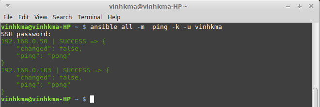
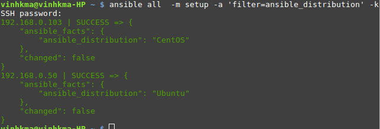

# Tìm hiểu về ansible


## Đề mục
- [Vai trò - chức năng](#vaitrochucnang)
- [Cách cài đặt](#cachcaidat)
- [SSH Keys Authentication](#SSH_Keys)


<a name="vaitrochucnang"></a>
### Vai trò - Chức năng
- Dùng để configuration management và provisioning tool
- Sử dụng SSH để kết nối tới servers và chạy các configured Tasks.

<a name="cachcaidat"></a>
### Cách cài đặt
- Mô hình
```sh
                            |------Client1(Ubuntu 16.04)
                            |
Server(Linux mint 18.01)--|
                            |
                            |------Client2(CentOS 6.5)
```

- Cài đặt phía Server
```sh
sudo apt-add-repository -y ppa:ansible/ansible
sudo apt-get update
sudo apt-get install -y ansible
```
- Kiểm tra phiên bản của Ansible đã được cài đặt .
```sh
vinhkma@vinhkma-HP ~ $ ansible --version
ansible 2.2.2.0
   config file = /etc/ansible/ansible.cfg
   configured module search path = Default w/o overrides
vinhkma@vinhkma-HP ~ $
```

- Phía Client không cần cài đặt, chỉ cần cho phép truy nhập ssh bằng pass dạng text hoặc sử dụng ssh-key . Ở đây mình sử dụng ssh-key để xác thực .

<a name="SSH_Keys"></a>

### SSH Keys Authentication
 - SSH key hoạt động dạng Server- Client , kết nối được tạo bởi quá trình bắt tay giữa SSH Server-SSH Client .
 - SSH Keys gồm 2 thành phần :
   - **Private Key** : là file đã được mã hóa lưu ở Client , cần giữ cẩn thận file này nó còn dùng để **lấy lại Public Key**
   - **Public Key** : File được mã hóa được ***lưu trên Server***
   - **Passphrase** : Là mật khẩu dùng để nhận diện Public Key và Private Key khi tạo ssh connection , còn dùng để lấy lại Public Key .

 - Sử dụng lệnh **ssh-keygen** trên Linux để tạo cặp khóa : Public Key và Private Key .  
    - **id_rsa** : Private Key
    - **id_rsa.pub** : Public Key
 - Tiếp theo thì Private Key sẽ được giữ lại ở Client , còn Public Key sẽ được đẩy lên Server bằng cách :
    ```sh
    vinhkma@vinhkma-HP ~ $ scp /home/vinhkma/.ssh/id_rsa.pub root@192.168.0.103:/home/vinhkma/
    ```
 - Ta đưa khóa public vào file authorized_keys trong thư mục /home/user_name/.ssh trên máy remote, nếu chưa có ta tạo ra file này :
   ```sh
     vinhkma@centos ~$ cat /home/vinhkma/id_rsa.pub >> /home/vinhkma/.ssh/authorized_keys
   ```

  - Ok vậy ta đã có thể remote mà không cần mật khẩu .

- Giờ ta sẽ tạo file `/etc/ansible/hosts` mới với nội dung như sau :

```sh
[ubuntu]
192.168.0.50

[centos]
192.168.0.103
```

- Kiểm tra ping tới các máy Client bằng Ansible
```sh
ansible all -m  ping -k -u vinhkma
```

- Giải thích option :

```sh
all : gọi tất cả các server được khai báo trong file hosts (ví dụ này là 04 server, kể cả chính máy chủ cài Ansible Server)
-m ping : sử dụng mô-đun ping trong Ansible để thực hiện lệnh ping.
-k : yêu cầu xác thực khi thực hiện các lệnh từ xa đối với Client.
-u vinhkma : đăng nhập và thực hiện lệnh `ping` ở trên bằng tài khoản user là vinhkma .
```

- Kết quả sẽ như sau:

 


- iểm tra phiên bản của các máy Client
```sh
ansible all  -m setup -a 'filter=ansible_distribution' -k
```

