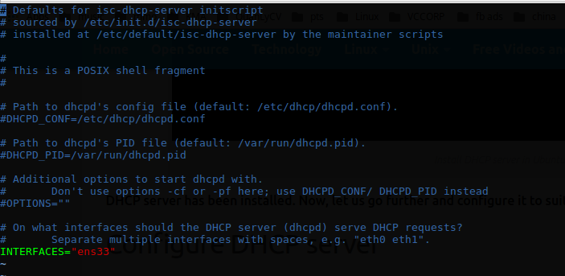
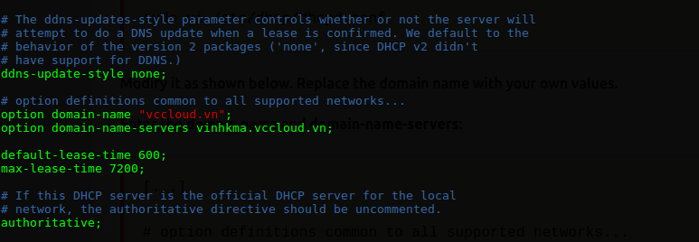
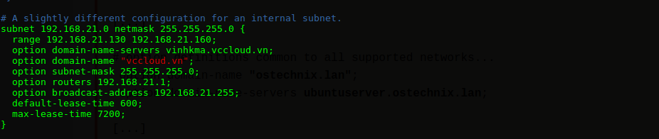
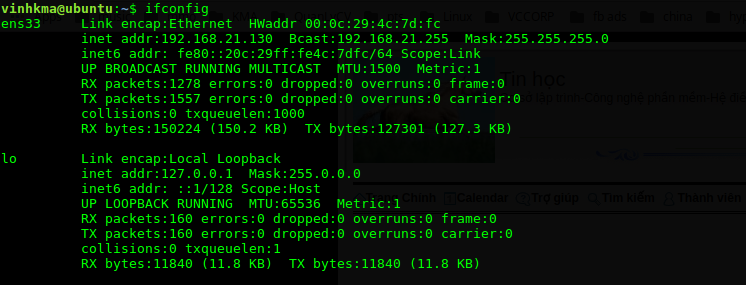

# Tìm hiểu về DHCP
DHCP là viết tắt của Dynamic Host Configuration Protocol, là giao thức Cấu hình Host Động được thiết kế làm giảm thời gian chỉnh cấu hình cho mạng TCP/IP bằng cách tự động gán các địa chỉ IP cho khách hàng khi họ vào mạng. Dich vụ DHCP là một thuận lới rất lớn đối với người điều hành mạng. Nó làm yên tâm về các vấn đề cố hữu phát sinh khi phải khai báo cấu hình thủ công.

***Ưu điểm mà DHCP mang lại :***
+ Tập chung quản trị thông tin về cấu hình IP.
+ Cấu hình động các máy.
+ Cấu hình IP cho các máy một cách liền mạch
+ Sự linh hoạt
+ Khả năng mở rộng.

***Thành phần của một DHCP server bao gồm :***
<ul>
<li>Options: Dùng để cung cấp các yếu tố cho phía client như địa chỉ IP, địa chỉ subnet mask, địa chỉ Gateway, địa chỉ DNS ... </li>
<li>Scope: Một đoạn địa chỉ được quy định trước trên DHCP server mà chúng ta sẽ dùng để gán cho các máy client.</li>
<li>Reservation: Là những đoạn địa chỉ dùng để “để dành” trong một scope mà chúng ta đã quy định ở trên.</li>
<li>Lease: Thời gian “cho thuê” địa chỉ IP đối với mỗi client.</li>
</ul>

***Cài đặt DHCP trên Ubuntu 16.04***

*Cài đặt DHCP server*

`sudo apt-get install isc-dhcp-server -y`

 *Cấu hình DHCP Server*
 
- Chỉnh sửa file cấu hình /etc/default/isc-dhcp-server

- Chỉnh sửa tên network interface sao cho phù hợp với card mạng của bạn :

- Sau đó chỉnh sửa file dhcpd.conf để cấu hình sao cho phù hợp các thông số như domain name, domain name server, dải IP cấp phát cho các máy client .

`sudo vi /etc/dhcp/dhcpd.conf`

- Ở đây mình để IP range từ 192.168.21.130-192.168.21.160, nghĩa là nó sẽ tự động cấp IP cho client trong khoảng IP này.

- Như vậy cấu hình đã hoàn tất, ta restart dịch vụ
`sudo systemctl restart isc-dhcp-server`

- Bây giờ ta sẽ kiểm tra IP client sử dụng lệnh :
`ifconfig`

- Như ta có thể thấy địa chỉ client đã nhận địa chỉ IP trong dải mà chúng ta đã cấu hình trước :)
