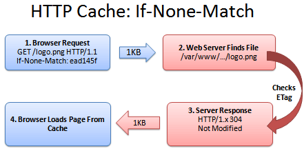

# Tổng quan về HTTP Caching
- [1. HTTP Caching là gì ? ](#httpcaching)
- [2. Lợi ích của HTTP Caching](#loiichhttpcaching)
- [3. Một số Nguyên tắc HTTP Caching](#nguyentachd)
- [4. Các giải pháp HTTP Caching](#giaiphap)

    [4.1 Tham số Last-Modified](#Last-Modified)
    [4.2 Tham số `Etag`](#etag)
    [4.3. Tham số Expires](#expires)
    [4.4. Tham số Cache-control](#cache-control)

___

# 1. HTTP Caching là gì ?
 - Là kĩ thuật di chuyển các bản copy các tài nguyên tĩnh phía **Server** xuống lưu ở dưới **Client** .Tác dụng giúp cho người dùng sẽ cảm thấy độ trễ rất thấp khi y/c tài nguyên tĩnh này từ phía **Server** , lưu lượng truyền đi ít hơn , số request đến **Server** ít hơn .

 

 - Quy trình thực hiện :
   <ul>
    <li>1. **Client** yêu cầu file index.html</li>
    <li>2. **Server** sẽ tìm kiếm xem file index.html ở đâu</li>
    <li>3. **Server** tìm thấy và trả về cho **Client** </li>
    <li>4. **Client** sẽ download file và hiển thị cho người dùng </li>
  </ul>

*Giả thiết đặt ra là nếu một file tĩnh ít khi bị thay đổi thì sẽ có những bất cập xảy ra là mỗi lần client y/c thì Server lại phải tìm kiếm file đó và trả về cho Client , rồi Client lại download thì mới sử dụng được . Điều đó là quá lãng phí thời gian của Server và thời gian của ng sử dụng*

# 2. Lợi tích của HTTP Caching .
  <ul>
    <li>Tăng hiệu năng tải cho website (giảm thời gian trễ )</li>
    <li>Giảm băng thông sử dụng </li>
    <li>Giảm số lần request từ Clien lên Server</li>
  </ul>

# 3. Một số Nguyên tắc HTTP Caching
  - Nếu trong **Response Header** từ `Server` có thông tin không cho phép lưu cache, Browser sẽ không được quyền lưu.
  - Nếu đối tượng trong request có yêu cầu xác thực hay bảo mật (VD: HTTPS), nó sẽ không được phép lưu trong **shared cache**
  - Nếu một đối tượng được gọi là "mới" được phép lưu cache ở **Browser** mà không cần xác thực với ` Server ` thì nó cần phải có thông tin về khoảng thời gian tồn tại.
  - Nếu một đối tượng được gọi là "cũ", `Server` sẽ nhận được yêu cầu xác thực đối tượng và báo cho Client biết nó còn giá trị sử dụng hay không. Trong trường hợp này `Client` và `Server` chỉ trao đổi với nhau thông qua việc truyền và gửi **message** để confirm nên lưu lượng sẽ giảm đi rất nhiều so với việc gửi cả một đối tượng có dung lượng xác định.

  *Như vậy Client sẽ ko phải download những file hàng trăm KB hay MB với mỗi request mà Client y/c lên Server mà giờ chỉ bằng việc trao đổi **message** với dung lượng cực nhỏ thì Client đã có được thông tin mình cần , đồng thời Server cũng giảm thiểu các request cần xử lí . **Message** ở đây là các tham số **HTTP Header** hỗ trợ*
___

# 4. Giải pháp HTTP Caching

  - Ở đây đề cập đến các tham số **HTTP Header** nó mang tính chất truyền thông điệp giữa Client và Server , là thông tin đối sánh để Client biết lấy dữ liệu từ **Cache** hay lại fai request lên Server để lấy dữ liệu .

  

 ## 4.1 Tham số Last-Modified
    - Khi lần đầu tiên Clien request một file từ **Server** , file này chưa hề đc lưu trong **Cache** ở Client , Server sẽ trả về cho Client file đó kèm theo tham số **Last-Modified**
    trên **Response Headers** để xác định thời điểm cuối cùng file đó được sửa đổi .

 
 

   - Quá trình thực hiện :
    <ul>
      <li>Đầu tiên , **Client** sẽ y/c request kèm theo điều kiện lấy ngày thay đổi của file đó (Tham số `If-Modified-Since ` trong **Request Header** )</li>
      <li>Server sẽ đi tìm file và kiểm tra xem ngày thay đổi có khớp với thông tin **Client** gửi lên không .</li>
      <li> Nếu Server check Ok , Client sẽ nhận dc `Status Code ` là **304 Not Modified** </li>
      <li>Clien sẽ ko phải download file đó từ Server mà vào trong Cache để lấy file đó .</li>
    </ul>

     Trong trường hợp nếu tham số  `If-Modified-Since` trong **Request Header** và `Last-Modified` trong **Response Header** không trùng nhau thì clien sẽ download file mới , lưu Cache đồng thời lưu thông tin ngày thay đổ mới .

 ## 4.2 Tham số `Etag`    

  - Cơ chế hoạt động `Etag` gần giống với `Last_modified` chỉ khác `Etag` có giá trị là một chuỗi kí tự đại diện cho file .

   
 

   Hoạt động :
    <ul>
        <li>Client yêu cầu file từ Server, và gửi kèm theo tham số If-None-Match (chính là giá trị của Etag) trong **Request Headers** đã lưu trước đó .</li>
        <li>Server tìm kiếm file  và kiểm tra mã `Etag`.</li>
        <li>Nếu Server check OK, Client sẽ nhận được Status Code là `304 Not Modified` .
        </li>
        <li>Clien sẽ ko phải download file đó từ Server mà vào trong Cache để lấy file đó </li>
    </ul>

  ## 4.3 Tham số `Expires`
   `Chú ý ` : Để khắc phục nhược điểm của `Etag` và `Last-Modified` là ta vẫn cứ phải chui lên Server để kiểm tra xem file đó có sự thay đổi không thì ở tham số `Expires` có thể khắc phục được nhược điểm đó .
  - Thông tin trong tham số Expires chính là thời điểm hết hạn của file đó, sau thời điểm này nếu Client vẫn muốn sử dụng file thì phải lên Server để download lại cũng như cập nhật thông tin Expires mới, còn nếu chưa hết hạn thì Client sẽ chỉ việc lấy thông tin từ Cache để sử dụng mà không cần hỏi lại Server.

  
 

  - Hoạt động :
  <ul>
    <li>Client cần request file , tuy nhiên kiểm tra thấy thời hạn hết hiệu lực chưa đến.</li>
    <li>Client tự lấy file đó từ Cache mà không cần lên Server hỏi</li>
  </ul>

## 4.4 Tham số Cache-Control
  - Về cơ bản giống `Expires` nhưng cấu hình linh hoạt và uyển chuyển hơn . Những tham số hỗ trợ cấu hình thông tin :
   <ul>
      <li> `Max-age=[seconds]` : định nghĩa khoảng thời gian tối đa mà file dc cache .</li>
      <li>`s-maxage=[seconds]` : giống tham số `max-age` nhưng tham số này chỉ được sử dụng cho **share cache** </li>
      <li>`public` : cho phép file được cache bởi các **Proxy** và server trung gian</li>
      <li>`Private` :file có giá trị khác nhau cho các Client khác nhau, Browser có thể cache nhưng Proxy thì không.
</li>
      <li>`no-cache` : không được phép cache file này .</li>
      <li>`no-store`: Chỉ hiện thị cho Client biết không được phép tạo bản copy file này và lưu trữ dưới bất kì hình thức nào .</li>
      <li>`must-revalidate`: chỉ thị bắt buộc phải validate lại với Server khi sử dụng file đã được cache.</li>
      <li>`proxy-revalidate`: tương tự như `must-revalidate` nhưng chỉ áp dụng cho các Proxy caches.</li>
   </ul>
