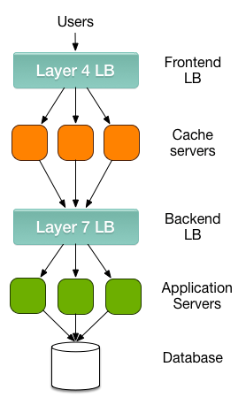
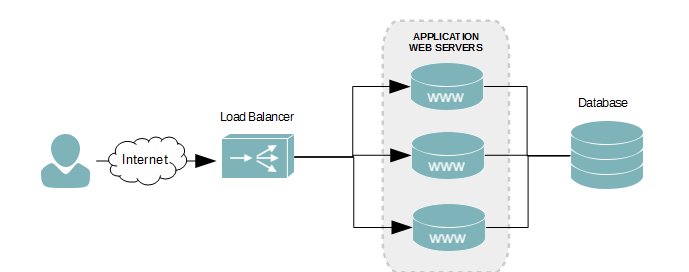
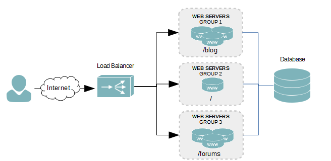

# Tìm hiểu về load banncing layer 4 và load banncing layer 7

[1. Load banncing layer 4](#layer4)
  - [1.1. Đặc điểm](#layer4dacdiem)
  - [1.2. Các kiểu cân bằng tải layer 4](#layer4_lb)
   - [1.2.1 NAT](#NAT)
   - [1.2.2. Direct routing](#directrouting)
   - [1.2.3. Tunnel](#tunnel)

[2. Load banncing layer 7](#layer7)
- [2.1. Đặc điểm](#layer7dacdiem)

___
 Load banncers chia làm 2 loại chính : Layer 4 và layer 7 

<ul>
  <li>
    Layer 4 load balancer xử  lí dữ liệu tìm thấy trong các giao thức ở tầng mạng và tầng giao vận (IP,TCP,UDP,FTP)  </li>
 <li>
  Layer 7 load balacer phân phối y/c dựa trên dữ liệu tìm thấy trong tầng ứng dụng , lớp giao thức như HTTP . 
 </li>
 </ul>

 `Sơ đồ so sánh giữa Load banncing layer 4 và layer 7 `
 
 

___

# 1. Load balancing layer 4

## 1.1. Đặc điểm
 
 

 <ul>
  <li>Layer 4 load balancer chỉ đơn giản là chuyển tiếp gói dữ liệu mạng đến và đi từ máy chủ upstream mà không kiểm tra nội dung của các gói dữ liệu. </li>
  <li>Phương pháp này điều hướng request dựa trên Range Ip và Port. Khi loadbanncer tiếp nhận 1 request , nó sẽ điều hướng dến các server backend , khi một server backend tiếp nhận request nó sẽ trả lời trực tiếp với client .  </li>
  <li> `Nhược điểm` :  Thích hợp với server chỉ có 1 website , nếu có nhiều server hoặc có các y/c phức tạp hơn thì dùng layer 7 </li>
  <li> `Ưu điểm` : Tốn ít tài nguyên do đó nhanh hơn so với cân bằng tải dựa trên layer 7 </li>
 </ul>
 
## 1.2. Các kiểu cân bằng tải layer 4
 
  - #### 1.2.1 . NAT (Network Address Translation )
   
   - ** Đặc điểm **
      - Làm việc với các máy chủ backend (real server) bằng cách thay đổi default gateway để trỏ đến bộ cân bằng tải .
      - High Performance vì nó hoạt động giống như một router .
      - Là minh bạch với máy chủ thực ( Server log hiển thị đúng địa chỉ IP của client)

  - #### 1.2.2. Direct Routing
   
    - ** Đặc điểm **
      - Là kĩ thuật cân bằng tải duy nhất ko y/c default gateway trỏ đến bộ cân bằng tải .
      - Tính minh bạch hoàn toàn : Server sẽ thấy một kết nối trực tiếp từ IP client và trả về cho client thông qua default gateway thông thường .

  - #### 1.2.3. Tunnel
     
     - ** Đặc điểm **
       - Bộ cân bằng tải lấy y/c từ client sau đó đóng gói chúng với IP tunnel để chuyển tiếp chúng tới máy chủ .

 ___

# 2. Load balancing layer 7

 
 

 - ** Đặc điểm **
 <ul>
  <li> Ở layer 7 load balancer hoạt động ở lớp application , nó sẽ xử lí trực tiếp với nội dung của gói dữ liệu. Nó có thể quyết định cân bằng tải dựa trên nội dung của gói tin (URL hoặc cookie...) sau đó sẽ tạo 1 kết nối TCP dến máy chủ uptream đã chọn và tạo ra y/c đến máy chủ . </li>
  <li> Chúng ta có thể chia tải dựa theo request của người dùng . Ta có thể cấu hình để chuyển các request dến static content qua các server xử lí static(html,css,js,ipg...) .  Còn các request khác thì chuyển qua cụm server xử lí dynamic content .</li>
  <li> Khác với layer 4 thì ở layer 7 ta sẽ phải đọc nội dung của request , sau đó dựa theo ALC để chuyển hướng gói tin đến cụm server tương ứng .</li>
  <li>`Nhược điểm` : Tốc độ chậm hơn so với layer 4 </li>
  <li> `Ưu điểm`: Xử lí được những y/c phân tải phức tạp. </li>
 </ul>
