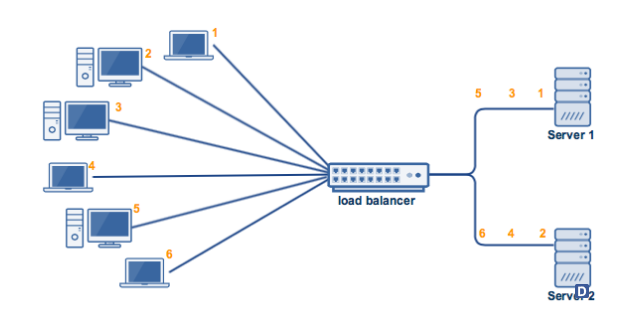
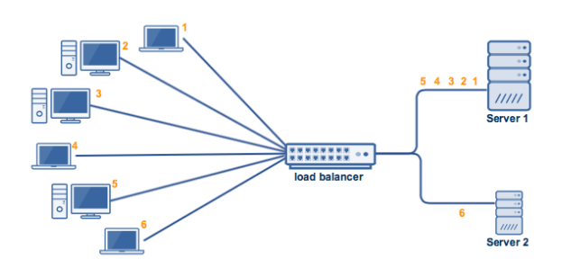
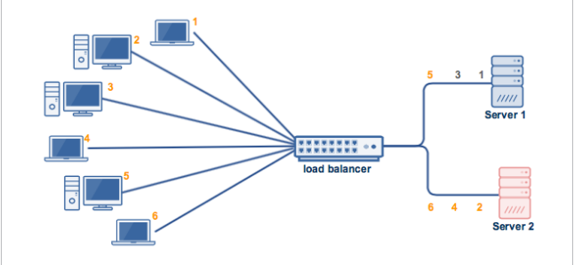

# Các thuật toán cân bằng tải

## 1.Thuật toán quay vòng (round-robin)
## 2.Thuật toán quay vòng có trọng số (weight round-robin)
## 3.Thuật toán least connection
___

### 1 .Thuật toán quay vòng (round-robin)
 - Là thuật toán luân chuyển vòng, các máy chủ sẽ được xem ngang hàng và sắp xếp theo một vòng quay. Các truy vấn dịch vụ sẽ lần lượt được gửi tới các máy chủ theo thứ tự sắp xếp.
 - Là thuật toán thường dùng rất đối với hệ thống vừa và nhỏ , ít đòi hỏi về khả năng mở rộng .

 - Hoạt động như hình vẽ :
   
 `Nhược điểm ` : Nếu server 1 có nhiều CPU , RAM ..(Cấu hình cao hơn) Server 2 nên server 1 có thể xử lí khối lượng công việc lớn hơn Server 2 , nhưng đối với thuật toán round robin thì trong load banner vẫn coi hai máy là như nhau =>  Server 2 có thể bị quá tải nhanh hơn .
___

 ### 2 . Thuật toán quay vòng có trọng số (weight round-robin)
 - Bản chất giống thuật toán round-robin , nhưng ta có thể chọn một máy chủ thường xuyên sử dụng hơn .
 - `Cơ chế hoạt động ` :
  

 - Server 1 có khả năng xử lí gấp 5 lần server 2 . Khi đó ta sẽ gán trọng số cho Server 1 là 5 và Server 2 là 1 .
 Do vậy các y/c gửi từ client thì cứ 5 y/c gửi đến sẽ được chuyển đến cho Server 1 và y/c thứ 6 sẽ được chuyển đến cho Server 2 .

 ___

 ### 3. Thuật toán least connection
 - Thuật toán dựa trên tính toán số lượng kết nối đến để thực hiện cân bằng tải cho máy chủ,nó sẽ tự động lựa chọn máy chủ với số lượng kết nối đang hoạt động là nhỏ nhất.
 - `Hoạt động` :
   
 - Thuật toán này sẽ đưa vào xem xét số lượng các kết nối hiện tại mỗi máy chủ . Khi một khách hàng kết nối, bộ cân bằng tải sẽ cố gắng để xác định máy chủ nào có số lượng ít nhất các kết nối và sau đó gán kết nối mới với máy chủ đó.

 ### 4 . Thuật toán Weighted Least Connections
 - Thuật toán quan tâm đến trọng số và tổng số kết nối đến ...
