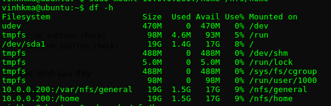
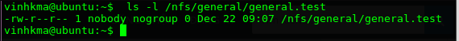
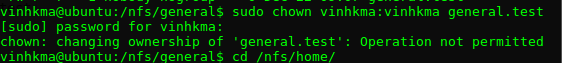
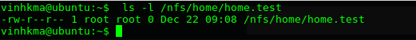

# Tìm hiểu về NFS – Network File System 
###Mục lục

[1. Giới thiệu về NFS](#about-nfs)

[2. Định dạng cấu hình trong NFS](#format-nfs)

[3. Cài đặt cấu hình NFS Server trên Ubuntu](#install-nfs) 

####<a name="about-nfs"></a>1. Giới thiệu về NFS

- NFS là hệ thống File System được xây dựng trên hệ điều hành Linux với mục đích cung cấp dịch vụ truy cập file từ xa giống như truy cập trên máy tính local, việc truy cập thông qua môi trường mạng (thông thường là mạng LAN – Ethernet). 
- NFS sử dụng mô hình Client/Server. Trên server có các disk chứa các file hệ thống được chia sẻ và một số dịnh vụ chạy ngầm (daemon) phục vụ cho việc chia sẻ với Client.
- Các Client muốn sử dụng các file system được chia sẻ thì sử dụng giao thức NFS để mount các file đó về.


####<a name="format-nfs"></a>2. Định dạng cấu hình trong NFS Server

- NFS sử dụng tập tin /etc/exports để lưu danh sách tập tin hệ thống được chia sẻ và tên máy tính (hoặc địa chỉ IP tương ứng) được cấp quyền sử dụng. 
- Tập tin /etc/exports có cấu trúc như sau:
`<directory><host1>(<options>) <hostN>(<options>)...`

- Giải thích :
<ul>
- directory : Là thư mục mà bạn muốn chia sẻ .
- host : là các máy client sẽ truy cập thư mục được chia sẻ. Có thể sử dụng DNS hoặc địa chỉ IP.
- options :
<ul>
<li> ro: thư mục được chia sẻ chỉ có quyền đọc. </li>
<li>rw: Các máy client có quyền read và write trên thư mục được chia sẻ.</li>
<li>no_root_squash:  Mặc định, NFS dịch các yêu cầu từ người dùng gốc từ xa sang người dùng không có quyền trên máy chủ. Điều này được cho là một tính năng bảo mật bằng cách không ch phép một tài khoản root trên máy client sử dụng hệ thống tập tin của máy chủ host như là người dùng root. Chỉ thị này vô hiệu hóa một số chia sẻ nhất định.
</li>
<li>noaccess: cấm truy cập vào các thư mục cấp con của thư mục được chia sẻ.​ </li>
<li> nosubtreecheck: Tùy chọn này ngăn việc kiểm tra cây con, đó là một tiến trình mà máy chủ host phải kiểm tra xem tệp có thực sự vẫn còn trong export tree mỗi khi có yêu cầu. Điều này có thể có nhiều vấn đề khi một tập tin được đổi tên trong khi client được mở. Trong hầu hết trường hợp, tốt hơn là vô hiệu hóa việc kiểm tra subtree.</li>

- sync: thông báo cho client biết 1 file đã được ghi xong- tức là nó đã được ghi để lưu trữ an toàn khi mà NFS hoàn thành việc kiểm soát ghi lên các file hệ thống. 
</ul>
</ul>

- Ví dụ: Ta cần chia sẻ thư mục /home/vinhkma cho các máy có địa chỉ từ 192.168.0.0 đến 192.168.0.15 quyền read+write thì tập tin /etc/exports viết là:
`/home/vinhkma 192.168.0.0/28(rw)​`

***Lưu ý: giữa tên máy hoặc địa chỉ IP với quyền hạn thường không có dấu cách:*** 
- Nếu bạn viết lại tập tin/etc/exports như sau:

`/home/vinhkma 192.168.0.0/28 (rw)​`

- Thì các máy từ 192.168.0.0 đến 192.168.0.15 chỉ có quyền đọc, còn các máy khác (địa chỉ IP không thuộc dải trên) lại có quyền đọc và ghi đầy đủ.

- Khi cần chia sẻ cho nhiều máy thì tên các máy (hoặc địa chỉ IP) có thể viết trên cùng một dòng nhưng cách nhau bằng khoảng trắng.

####<a name="install-nfs"></a>3. Cài đặt cấu hình NFS Server trên Ubuntu 16.04

- Cài đặt NFS

`sudo apt-get install nfs-kernel-server`

 ***Tạo thư mục chia sẻ trên NFS Server***

- Mình sẽ tạo ra hai thư mục chia sẻ riêng biệt, với các thiết lập cấu hình khác nhau, để minh họa hai cách chính mà NFS gắn kết (mount) có thể được cấu hình liên quan đến truy cập superuser.

- Superusers có thể làm bất cứ điều gì bất cứ nơi nào trên hệ thống. Tuy nhiên, các thư mục NFS-mounted không phải là một phần của hệ thống mà nó được gắn kết, vì vậy mặc định, máy chủ NFS từ chối thực hiện các hoạt động đòi hỏi đặc quyền superuser.

- Hạn chế mặc định này có nghĩa là superusers trên máy khách (client) không thể ghi tập tin như là root, chỉ định lại quyền sở hữu, hoặc thực hiện bất kỳ nhiệm vụ nào trên NFS mount.

*Tạo một thư mục cho mục đích chia sẻ chung*

 `sudo mkdir /var/nfs/general -p`
 
- Vì ta tạo ra nó với lệnh sudo, thư mục này được sở hữu bởi root trên máy chủ. Ta sẽ đổi quyền sở hữu thư mục:

`sudo chown nobody:nogroup /var/nfs/general`

*Tạo một thư mục Home*

 - Trong ví dụ thứ hai này, mục đích là để làm cho các thư mục người dùng trong home được lưu trữ trên các máy chủ có sẵn trên các máy chủ client, trong khi cho phép các quản trị viên đáng tin cậy của các máy chủ client truy cập để thuận tiện quản lý người dùng.
- Để làm điều này, chúng tôi sẽ xuất thư mục /home. Kể từ khi nó đã tồn tại, ta không cần phải tạo ra nó. Ta sẽ không thay đổi quyền. Nếu làm việc đó, nó sẽ gây ra vấn đề.

***Cấu hình Xuất NFS trên máy chủ Host***

-Mở tập tin /etc/exports

 `sudo nano /etc/exports`
 
 - Add thêm 2 dòng sau vào cuối file 
 
```
    /var/nfs/general 203.0.113.256(rw,sync,no_subtree_check)
   /home 203.0.113.256(rw,sync,no_root_squash,no_subtree_check) 
```

- Sau đó, khởi động lại máy chủ NFS với các lệnh sau đây:

`sudo systemctl restart nfs-kernel-server `

- Điều chỉnh Firewall trên máy chủ :

`sudo ufw allow from 10.0.0.130 to any port nfs`

- Điều này khẳng định rằng UFW sẽ chỉ cho phép lưu lượng NFS trên cổng 2049 từ máy client.

### Cấu hình trên NFS Client

- Cài đặt NFS Common 

`sudo apt-get install nfs-common`

- Để làm cho các thưc mục shares từ xa có sẵn trên máy client, ta cần phải gắn kết (mount) các thư mục host trên một thư mục client trống.

- Lưu ý: Nếu có những tập tin và thư mục trong điểm gắn kết (mount) của bạn, ngay sau khi bạn gắn kết (mount) chia sẻ NFS, chúng sẽ được ẩn. Hãy chắc chắn rằng bạn gắn kết trong một thư mục đã tồn tại, thư mục này phải rỗng.

Chúng tôi sẽ tạo hai thư mục để gắn kết với thư mục host.

```
   sudo mkdir -p /nfs/general
   sudo mkdir -p /nfs/home 
```

 Gắn kết các thư mục trên Client
 
 ```
    sudo mount 10.0.0.130:/var/nfs/general /nfs/general
    sudo mount 10.0.0.200:/home /nfs/home
```

- Kiểm tra rằng chúng gắn kết thành công trong một số cách. Dùng lệnh sau:

`df -h`



***Kiểm tra quyền truy cập NFS***

- Đầu tiên, tạo 1 file trong thư mục /var/nfs/general

`sudo touch /nfs/general/general.test `

- Kiểm tra quyền của file vừa tạo ra :

` ls -l /nfs/general/general.test`



- Bởi vì chúng ta gắn kết bộ đĩa (volume) này không làm thay đổi hoạt động mặc định NFS và tạo ra các tập tin với người dùng root máy client thông qua lệnh sudo, quyền sở hữu của các tập tin mặc định đến nobody:nogroup.

- Superusers client sẽ không thể thực hiện hành động quản trị như thay đổi chủ sở hữu của một tập tin hoặc tạo ra một thư mục mới cho một nhóm người dùng, trên chia sẻ NFS-mounted này.



*Để so sánh các điều khoản của mục đích chia sẻ chung với các phần Home Directory, tạo một tập tin Home Directory với với quyền sudo:
*

`sudo touch /nfs/home/home.test`

- Sau đó quyển tra quyền file vừa tạo :

`ls -l /nfs/home/home.test`



- Ta có thể thấy file home.test được tạo bởi root thông qua lệnh sudo, như  cách mà chúng ta tạo ra các tập tin general.test. Tuy nhiên, trong trường hợp này nó được sở hữu bởi root bởi vì chúng ta huỷ bỏ hoạt động mặc định khi chúng tôi xác định các tùy chọn no_root_squash trên gắn kết (mount) này.

- Điều này cho phép người sử dụng root của chúng ta trên máy client hoạt động như root của clinet và làm cho việc quản lý các tài khoản người dùng thuận tiện hơn nhiều.
