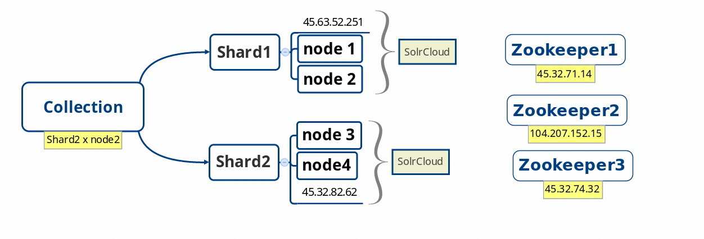
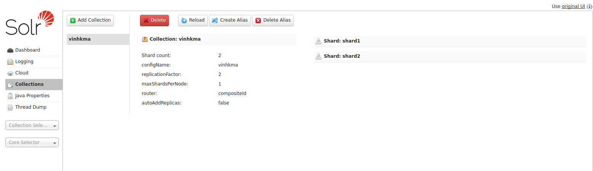
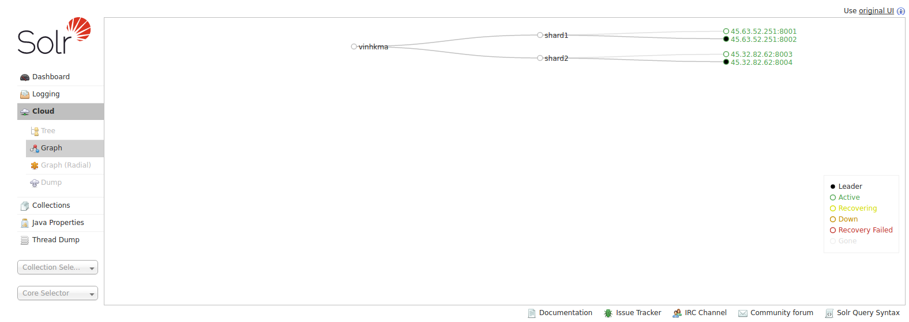

# Cài đặt hệ thống SolrCloud

## Mô hình triển khai 




#### Ở đây mình sẽ cài đặt trên 5 máy

 ```sh
45.63.52.251        solr1
45.32.82.62         solr2

45.32.71.14        : zookeeper1
104.207.152.15     : zookeeper2
45.32.74.32        : zookeeper3
```

### Đầu tiên ta sẽ đi cài đặt môi trường

```sh
 sudo apt-get update
 sudo apt-get install default-jre
```

### Cài đặt  ZooKeeper
- Dowload Zookeeper và giải nén

```sh
vinhkma@ubuntu $ wget http://mirror.downloadvn.com/apache/zookeeper/zookeeper-3.4.8/zookeeper-3.4.8.tar.gz

vinhkma@ubuntu $tar xvzf zookeeper-3.4.8.tar.gz


```
- Cấu hình Zookeeper lần lượt trên 3 server Zookeeper1,Zookeeper2,Zookeepe3  :

```sh
vinhkma@ubuntu $ cd zookeeper-3.4.8/conf
vinhkma@ubuntu $ cp zoo_sample.cfg  zoo.cfg
vinhkma@ubuntu $ vi zoo.cfg

```
- Thêm dòng sau vào file zoo.cfg

```sh
dataDir=/home/vinhkma/zookeeper
clientPort=2181
server.1=45.32.71.14:2888:3888
server.2=104.207.152.15:2888:3888
server.3=45.32.74.32:2888:3888
```
- Trên Zookeeper1
```sh
vinhkma@ubuntu $ mkdir zookeeper
vinhkma@ubuntu $ echo 1 > zookeeper/myid
```
- Trên Zookeeper2
```sh
vinhkma@ubuntu $ mkdir zookeeper
vinhkma@ubuntu $ echo 2 > zookeeper/myid
```
- Trên Zookeeper3
```sh
vinhkma@ubuntu $ mkdir zookeeper
vinhkma@ubuntu $ echo 3 > zookeeper/myid
```
- Activate ZooKeeper
```sh
vinhkma@ubuntu $  cd zookeeper-3.4.8/
vinhkma@ubuntu $ bin/zkServer.sh start
```

### Cài đặt Solr

-  Dowload Solr và giải nén

```sh
vinhkma@ubuntu:~$ wget http://mirror.downloadvn.com/apache/lucene/solr/6.5.0/solr-6.5.0.tgz
vinhkma@ubuntu:~$ tar xzf solr-6.5.0.tgz
```
### Create a Node

- Create node 1 ở server solr1 với IP : 45.63.52.251 sử dụng cổng 8001

```sh
$ cd solr-6.5.0/
$  mkdir -p myserver/node1/solr
$ cp server/solr/solr.xml myserver/node1/solr/
$  ./bin/solr start -cloud -s /home/vinhkma/solr-6.5.0/myserver/node1/solr -p 8001 -z 45.32.71.14:2181,104.207.152.15:2181,45.32.74.32:2181 -h 45.63.52.251

```
- Create node 2  ở server solr1 với IP : 45.63.52.251 sử dụng cổng 8002

```sh
$ cd solr-6.5.0/
$  mkdir -p myserver/node2/solr
$ cp server/solr/solr.xml myserver/node3/solr/
$  ./bin/solr start -cloud -s /home/vinhkma/solr-6.5.0/myserver/node2/solr -p 8002 -z 45.32.71.14:2181,104.207.152.15:2181,45.32.74.32:2181 -h 45.63.52.251
```
- Create node 3 ở server solr2 với IP : 45.32.82.62 sử dụng cổng 8003

```sh
$ cd solr-6.5.0/
$  mkdir -p myserver/node3/solr
$ cp server/solr/solr.xml myserver/node3/solr/
$  ./bin/solr start -cloud -s /home/vinhkma/solr-6.5.0/myserver/node3/solr -p 8003 -z 45.32.71.14:2181,104.207.152.15:2181,45.32.74.32:2181 -h 45.32.82.62

```

- Create node 4 ở server solr2 với IP : 45.32.82.62 sử dụng cổng 8004

```sh
$ cd solr-6.5.0/
$  mkdir -p myserver/node4/solr
$ cp server/solr/solr.xml myserver/node4/solr/
$  ./bin/solr start -cloud -s /home/vinhkma/solr-6.5.0/myserver/node4/solr -p 8004 -z 45.32.71.14:2181,104.207.152.15:2181,45.32.74.32:2181 -h 45.32.82.62

```

### Tạo Collection

- Ta sẽ tạo 1 collection với tên "vinhkma" và 2 shards , 2 replicationFactor

```sh
$ cd solr-6.5.0/
$ ./bin/solr create_collection -c vinhkma -d server/solr/configsets/data_driven_schema_configs -p 8001 -shards 2 -replicationFactor 2
```
- Bạn truy cập vào trang quản lí sẽ thấy giao diện như sau :
http://45.63.52.251:8001/solr/#/~collections/vinhkma

 

 
